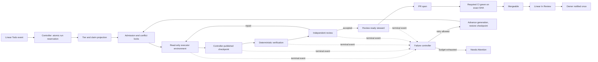

# Durable multi-agent product development: canonical execution plan and architecture

**Status:** Proposal for owner approval. No implementation, Linear transition, secret change,
workflow change, or constitution amendment is authorized merely by this document.

**Written:** 2026-08-15 against `main` at `438d342`. Re-measure every repository claim before
turning a phase into a Linear issue.

**Scope of supersession:** This document synthesizes and replaces the two planning drafts titled
*Cutting time-to-completion: plan and architecture* and *Reducing AI time-to-completion: a durable,
parallel execution plan*. It does **not** supersede `AGENTS.md`, `docs/swarm/constitution.md`,
Linear, or any owner ruling. Where this proposal conflicts with one of those authorities, the
authority wins until the owner explicitly amends it.

---

## 1. Executive decision

The current product-development process has strong quality gates and a weak execution substrate.
Premise checking, risk tiering, worker/checker separation, and mutation replay have caught real
defects. They stay. The expensive failure is that run state, unfinished prescriptions, and the next
required action still depend too heavily on one ephemeral executor.

The target system therefore separates two responsibilities:

- **Agents perform judgement and product work:** tiering, premise review, planning,
  implementation, adversarial review, and repair.
- **A deterministic controller owns execution:** claims, durable state, credentials, generation
  fencing, checkpoint publication, retries, concurrency admission, PR/CI completion, Linear
  projection, and notifications.

The largest expected gains come from preventing stranded work and running independent issues side
by side. Healthy model calls are not the first optimization target.

The implementation order is binding for this proposal:

1. Measure the current path.
2. Make the finish line and terminal failures deterministic.
3. Add durable checkpoints and prove manual resume.
4. Remove external-write authority from executors and enforce generation fencing.
5. Add bounded automatic recovery.
6. Add the review-ready steward.
7. Pilot two concurrent issues, then consider four.
8. Optimize healthy-path mechanics only after the architecture is stable.

Automatic retry and multi-issue scheduling do not ship before the controller can reject every stale
external mutation.

---

## 2. Objective and measurement contract

### 2.1 Primary outcome

Measure an **execution episode** from the exact Linear event that first promotes an issue into
`Todo` for that episode until the first instant all review-ready conditions are simultaneously true.
The episode is identified by a stable `run_id` and the originating Todo event id; it is not defined
as the issue's oldest-ever Todo timestamp.

The clock does not reset when:

- an executor fails;
- a generation is fenced;
- a retry begins;
- the issue temporarily returns to a recoverable state;
- a different model or container resumes the run; or
- the branch is rebased or resumed.

### 2.2 Review-ready definition

An execution episode is review-ready only when:

1. The intended implementation and required run evidence are durable.
2. Required local verification passed against the recorded head SHA.
3. The correct pull request is open for the issue.
4. The approved required CI checks are green for that exact PR head SHA.
5. GitHub reports the PR mergeable after those checks complete.
6. The Linear issue is in `In Review`.
7. The controller records no active worker, checker, repair, or successor dispatch.
8. The owner has received exactly one deduplicated review-ready notification.

Opening a PR is not completion. Moving Linear to `In Review` before the other conditions hold is
also not completion.

If the base branch later moves and the PR becomes conflicted, record a review-ready regression and
notify once. Do not rewrite the original metric endpoint; report the regression separately.

### 2.3 Outcomes and survivorship

Every episode ends in one named outcome:

- `review_ready`
- `premise_rejected`
- `needs_attention`
- `canceled_by_owner`
- `superseded`

Latency percentiles never stand alone. Report completion rate, terminal outcomes, and censored open
episodes beside them so failed work cannot disappear from the measurement.

Issues carrying `gate/human` are reported separately from the autonomous baseline. Human time after
an exceptional escalation is identified, not silently subtracted from the episode.

### 2.4 Diagnostic decomposition

Record at least:

- Todo waiting for admission
- claim and setup
- tier judgement, when needed
- premise and planning
- implementation
- deterministic verification
- independent model review
- repair and rework
- PR preparation
- CI and mergeability waiting
- dead-executor time
- retry delay
- controller or external-service delay
- exceptional human intervention
- tokens and notional consumption by phase and model tier

Summed `In Progress` time remains diagnostic only.

### 2.5 Out of scope

This plan does not optimize:

- Backlog-to-Todo promotion or owner prioritization
- human review after `In Review`
- auto-merge
- multi-issue sweep PRs
- broad source-file reorganization
- weakening risk tiering, premise review, independent checking, mutation replay, or the declaration
  gate
- broad persona-harness refactoring as a general latency strategy

---

## 3. Measured current-state diagnosis

The current path behaves like one long, human-supervised transaction:

> claim → plan → worker → checker → repair → gates → PR

The repository already records the consequences:

- Eight of thirteen measured dispatched runs stranded at PR time; five opened their own PR.
- Two attempts on GAM-344 died at the former 120-minute cap, and one lost the checker's inline
  repair prescription.
- Several runs ended while a background subagent was still in flight; the process exited and took
  the work with it.
- `In Progress` proves only that the Linear state was written, not that an executor is alive.
- The current PR path exposes `CLAUDE_PR_TOKEN || github.token` to the model process even though the
  measured successful PRs used the GitHub App identity and the observed shell path using the PAT
  failed.
- The executor receives both GitHub and Linear write credentials. A prompt-level generation check
  cannot prevent a stale executor from bypassing a helper.
- CI intentionally runs on every branch push. Checkpoint commits on a product branch therefore
  create or restart CI; they are not a noise-free heartbeat store.
- Linear has no compare-and-set. Two claimants can both write `In Progress`, both read it back, and
  both believe they own the issue.
- GitHub's per-issue concurrency group prevents two active workflow runs for one identifier but does
  not cap total concurrent issues or protect overlapping files.
- A dispatched run has already pushed directly to `main`, bypassing PR-only review controls.

The verification chain is not the architectural problem. The missing pieces are durable execution
state, an enforceable external-write boundary, modeled failure, and controlled admission.

---

## 4. Design principles and invariants

1. **Linear authorizes work; it does not own the lock.** The owner's Todo promotion remains the
   authorization event. An atomic controller record owns execution state. Linear reflects it.
2. **The controller is the only external writer.** Executors never receive credentials capable of
   pushing a branch, changing Linear, creating a PR, or dispatching a successor directly.
3. **Every shared mutation is fenced.** It carries `run_id`, `generation`, and expected state
   version. A stale generation receives a hard rejection.
4. **Checkpoints precede successors.** A worker, checker, repair, or steward is not dispatched until
   its predecessor's durable result exists.
5. **A checkpoint is not a claim of success.** It records what is durable and what remains.
6. **Manual resume is proven before automatic retry.** Recovery automation may only call a path
   already demonstrated by a fire drill.
7. **Terminal events precede TTL leases.** Workflow failure and cancellation are the first recovery
   triggers. Heartbeats and time-based lease expiry are added only if telemetry finds failures those
   events cannot detect.
8. **One file has one editing owner at a time.** Branches and worktrees isolate filesystems; lock keys
   prevent incompatible tasks from entering mutating phases together.
9. **Judgement stays with models; mechanics become code.** Scripts validate citations, labels,
   declared files, state transitions, gates, and checkpoint shapes. They do not pretend to judge the
   correct tier or whether a premise is substantively true.
10. **Safety changes dark-launch.** Telemetry, state recording, and steward observation run in shadow
    mode before they are permitted to mutate lifecycle state.

---

## 5. Target architecture

### 5.1 Controller and authoritative run store

Use the existing Supabase dispatch backend as the first implementation target for an operational
run table with transactional compare-and-set updates. This avoids coupling operational state to
product-branch CI and keeps Linear as a projection rather than a lock.

Before committing to the schema, a bounded spike must prove:

- one atomic conditional update can validate `run_id`, `generation`, and `version`;
- duplicate webhooks are idempotent;
- the executor can publish a result through a run-scoped capability without receiving service-role,
  GitHub, or Linear credentials;
- the controller can make GitHub and Linear writes after validating that result; and
- controller state is backed up or summarized into durable git evidence at episode completion.

If that spike fails, stop. Choose another controller store explicitly; do not silently fall back to
Linear or an ordinary product-branch file.

The authoritative record contains at least:

| Field | Purpose |
|---|---|
| `run_id` | Stable execution-episode identity |
| `issue_identifier` | Linear issue projection key |
| `todo_event_id`, `todo_at` | Authorization event and metric origin |
| `version` | Compare-and-set record version |
| `generation` | Fences obsolete executors |
| `status`, `phase` | Current state and last completed phase |
| `pipeline_version` | State-machine/schema version used by this run |
| `constitution_sha` | Ruleset the run began under |
| `branch`, `base_sha`, `head_sha` | Git consistency boundary |
| `active_executor` | Workflow/job identity, or null |
| `required_next_role` | Deterministic resume target |
| `result_refs` | Immutable packet, verdict, prescription, and evidence references |
| `infrastructure_retry_count` | Container/workflow recovery budget |
| `worker_attempt_count` | Constitution worker/checker loop budget |
| `premise_round` | Premise-gate round, separate from retries |
| `lock_keys` | Files, surfaces, migrations, workflows, and external resources held |
| `failure_class`, `failure_detail` | Named terminal-event evidence |
| phase timestamps | Metric and diagnosis source |
| notification keys | Deduplication for failure and completion notices |

### 5.2 External-write boundary

The executor receives:

- a read-only checkout with persisted checkout credentials disabled;
- an immutable issue payload and its hash;
- a branch name, base SHA, generation, and allowed-file packet;
- a run-scoped capability that can only submit a checkpoint candidate for that run and generation;
  and
- no GitHub token, Linear key, Supabase service-role key, or successor-dispatch credential.

The controller alone may:

- publish a checkpoint's commit, patch, bundle, verdict, or evidence after validation;
- push the task branch using the expected remote head SHA;
- move or label the Linear issue;
- open or edit the pull request;
- dispatch a successor or repair;
- advance the generation; or
- declare the episode review-ready.

The run-scoped capability cannot advance its own generation or choose a different issue. Revoking or
advancing the generation makes every later submission from the old executor fail closed.

### 5.3 Credential paths

Do not use credential fallback expressions whose behavior changes by availability.

- **Branch publication:** use one proven credential whose pushes trigger CI. The current evidence
  supports the human push token for this purpose.
- **PR creation:** pin the proven GitHub App path, unless a separately tested replacement is adopted.
- **Linear:** keep its write key in the controller only.

Run a credential preflight before expensive work. It verifies identity, repository, branch-write
capability, PR-create capability, and the expected CI-trigger behavior without creating a real task PR.
Failure is a visible terminal event.

### 5.4 Atomic claim protocol

For an already tiered issue:

1. Receive and validate the Todo webhook.
2. Atomically create the run record for `(issue, todo_event_id)` at generation 1.
3. Reject or return the existing record on a duplicate webhook.
4. Reflect the claim into Linear as `In Progress`.
5. Read back the Linear projection for evidence, while treating the controller record as ownership.
6. Dispatch the executor only after both the atomic reservation and projection succeed.

For `tier/unreviewed`:

1. Atomically reserve a `tier_pending` run without moving the issue to `In Progress`.
2. Dispatch a read-only tier-judgement step.
3. Have the controller apply the selected tier and then project `In Progress`.
4. Continue through the ordinary pipeline.

Constitution item 28 must be amended before this replaces its current Linear-first claim order. The
amendment preserves the owner's Todo promotion as authorization while making the claim real.

### 5.5 Durable phases and checkpoints

The common phase sequence is:

1. `reserved`
2. `claimed`
3. `premise_accepted`
4. `plan_approved`
5. `worker_committed`
6. `deterministic_checks_complete`
7. `model_review_complete`
8. `repair_complete`, when needed
9. `pr_open`
10. `ci_green`
11. `review_ready`

FAST and STANDARD episodes mark inapplicable phases explicitly; they do not silently skip them.
Dispatch-started and dispatch-finished are events around a phase, not extra phases.

A checkpoint records:

- the full state fields above;
- immutable input and result hashes;
- current branch/base/head SHAs;
- the exact verification commands, exit codes, and evidence refs completed against the head;
- pending checker prescription, if any;
- invalidated evidence and why it was invalidated;
- the next permitted transition; and
- the executor or successor expected to perform it.

The controller writes the checkpoint before dispatching the successor. The executor may create local
commits, but they are not durable until the controller publishes and records them.

No phase may be longer than the amount of work the owner is willing to lose. Telemetry must measure
phase p90. Split any phase whose duration exceeds the chosen recovery-point objective rather than
pretending a boundary at its end protects the work inside it.

### 5.6 Resume and evidence invalidation

A replacement executor must:

1. Verify the current generation and that no valid executor remains active.
2. Locate the controller-published branch and exact head SHA.
3. Restore the pipeline version and relevant ruleset.
4. Read the last durable result and pending prescription.
5. Check whether `main` or the task branch advanced.
6. Reuse completed evidence only if its input SHA and relevant files remain unchanged.
7. Resume the named next role.

Do not repeat a successful premise, implementation, or verification phase merely because the
container changed. Do repeat or invalidate it when the code, base, ruleset, packet, or required-check
contract changed in a way that can affect its verdict.

### 5.7 Failure, retry, and fencing

Start with deterministic terminal events:

- workflow failure or cancellation
- timeout or maximum-turn exhaustion
- explicit process error
- executor completion without the expected checkpoint
- subagent left in flight
- checkpoint publication rejection
- PR authentication failure
- missing branch or recorded SHA
- repository divergence
- controller or external-service failure

On a terminal event the controller atomically:

1. rejects further writes from the failed generation;
2. records the last checkpoint that was already durable;
3. classifies the failure;
4. sends one deduplicated operational notification;
5. advances the generation before any retry; and
6. restores from the named checkpoint or moves the episode to `Needs Attention`.

The controller cannot recover uncommitted memory or filesystem state after a runner dies. The plan's
guarantee is recovery from the last durable checkpoint, not zero data loss.

Begin with one automatic infrastructure retry. Permit a second only after telemetry shows the first is
safe and useful. This budget is independent of the constitution's three failed worker/checker attempts.

Do not implement TTL lease expiry or heartbeats until a measured failure lacks a GitHub terminal event.
If leases are later added, generation fencing lands first and the paused-old-executor test is mandatory.

### 5.8 Review-ready steward

The steward is deterministic and event-driven. It runs only after the mutating executor has ended and
the controller has a valid accepted checkpoint.

It must:

1. validate generation, branch, and head SHA;
2. confirm the required local evidence for the issue's tier;
3. open or identify the correct PR through the pinned credential path;
4. determine required checks from an owner-approved branch ruleset or checked-in manifest;
5. observe those checks for the exact head SHA;
6. confirm mergeability after the checks complete;
7. move Linear to `In Review` only then;
8. clear the active executor and release locks;
9. write the final run summary/audit reference; and
10. send one review-ready notification.

An observation-only steward may ship before full fencing. A steward that mutates Linear or dispatches a
repair may not. Targeted CI repair is a later capability of the fenced steward, not part of its first
shadow release.

### 5.9 Concurrency admission and isolation

Throughput comes from independent issues, not from overlapping editors.

The controller maintains:

- a global mutating-slot limit, initially 2;
- file and directory lock keys from packet Allowed Files;
- symbol or module locks for shared loaders and exported contracts;
- global locks for migrations, workflow files, governance records, and external deployment resources;
  and
- an owner-visible queued state that consumes no runner while waiting.

Before mutation begins, compute pairwise path intersections mechanically. Also inspect importers for
shared loaders; directory ownership alone is insufficient. If an executor discovers a required file
outside its declared scope, it requests an additional lock or stops. It never expands silently.

Every mutating task uses its own branch, runner, and worktree. Mutation experiments stay in the agent's
own isolated worktree. The current `WORKFLOWS.md` collision history is useful evidence but not a current
allocator; retired T-number blocks and frozen-ledger rules must not drive admission.

Pilot two concurrent issues. Scale to four only if:

- no double claim occurs;
- no stale-generation external write succeeds;
- no branch, worktree, file, migration, or external-resource collision occurs;
- slot release is correct after success, failure, and cancellation;
- per-task p90 and failure rate do not materially regress; and
- combined batch makespan improves by at least 25%.

Do not extrapolate the historical 10–15-agent proposal into this architecture. Four is a later measured
decision, not a target entitlement.

### 5.10 Mechanical preparation and model allocation

Use scripts for:

- symbol-based citation resolution, with line numbers treated as non-authoritative hints;
- packet size and token warnings;
- tier-label presence and required-pipeline enforcement;
- allowed-file intersections and lock derivation;
- checkpoint schema and state-transition validation;
- deterministic test selection and environment preparation;
- gate execution and exit-code capture; and
- PR declaration and required-check validation.

Keep models responsible for:

- selecting and defending the correct tier;
- deciding whether the premise is true;
- planning and implementation;
- deciding whether the diff satisfies the actual acceptance criteria;
- adversarial review; and
- architecture or dispute arbitration.

Prepare dependencies, a clean checker worktree, base comparison, and static context before the worker
finishes when that preparation can occur in a separate deterministic job. Do not start substantive
review until the worker result is durable.

---

## 6. Implementation program

Every implementation slice receives its own Linear issue and PR. New filings follow
`.claude/skills/linear-task-writing`; they begin in `Backlog` until the owner promotes them. This proposal
does not create, tier, promote, or claim those issues.

Core changes to `.github/workflows/**` are prepared and verified by an agent but must be applied through
an owner-scoped session, preserving the repository's workflow-permission wall. Each phase dark-launches
before it becomes authoritative.

### Phase 0 — Owner decisions and safety prerequisites

Deliverables:

- approve this document as the canonical proposal;
- choose or create the Linear `Needs Attention` state and notification behavior;
- approve the item-28 atomic-claim and bounded-recovery amendment;
- install branch protection or a repository ruleset that blocks direct pushes to `main`;
- approve the required-check source for the steward;
- approve the operational state-store spike; and
- decide which existing Backlog issues to promote.

Existing rows to re-check rather than duplicate:

- **GAM-333:** nondeterministic PR creation path
- **GAM-374:** direct pushes to `main` bypass review controls
- **GAM-385:** durable dispatch consumption and phase telemetry; currently Backlog with no tier label at
  plan-writing time

Acceptance:

- direct push to `main` is rejected;
- the required-check contract is machine-readable; and
- no architecture issue enters execution without the owner's Todo promotion.

### Phase 1 — Passive telemetry and immediate reliability

Deliverables:

- emit the run and phase events in §2 without changing lifecycle decisions;
- record raw event timelines, outcomes, tokens, and active executor time;
- preflight the distinct branch-push and PR-create credential paths;
- notify on every terminal failure, not only comments matching the current escalation marker;
- remove the per-edit full-repository lint hook after its baseline cost is captured, while retaining
  final verification; and
- add measured `timeout-minutes` bounds to the four CI jobs.

Acceptance:

- at least 95% of pilot runs produce a complete event timeline without manual reconstruction;
- a bad credential fails before expensive implementation;
- a terminal failure becomes visible within minutes; and
- telemetry cannot move Linear, create a PR, or dispatch a retry.

### Phase 2 — Controller state and manual checkpoints

Deliverables:

- prove the Supabase compare-and-set spike;
- implement the versioned run schema and transition validator;
- publish checkpoints at phase boundaries through a run-scoped capability;
- persist checker verdicts and prescriptions before repair dispatch;
- write a deterministic resume command or workflow; and
- produce a final git audit summary without using the product branch as the live lock store.

Acceptance:

- duplicate Todo events create one run;
- kill tests after every major phase resume from the correct checkpoint;
- successful phases are not repeated unless their inputs were invalidated;
- a missing or mismatched head SHA fails closed; and
- the manual resume fire drill succeeds before Phase 3 begins.

### Phase 3 — Credential isolation and generation fencing

Deliverables:

- remove GitHub and Linear write credentials from the executor process;
- route every external mutation through the controller;
- attach generation and expected version to every controller request;
- atomically advance generation on takeover; and
- add branch-head compare-and-set publication.

Acceptance:

- a paused old executor cannot publish a checkpoint, push branch state, change Linear, open/edit a PR,
  publish a verdict, dispatch a successor, or declare completion;
- an executor cannot target another issue or generation with its run capability;
- direct helper bypass attempts fail because the executor lacks the external credential; and
- all denials are durable, named events.

### Phase 4 — Bounded automatic recovery

Deliverables:

- extend the existing post-run assertion into a deterministic failure controller;
- retry once from the last valid checkpoint on approved infrastructure failure classes;
- keep premise, worker, and infrastructure counters separate;
- move exhausted episodes to `Needs Attention`; and
- deduplicate repeated terminal events and notifications.

Acceptance:

- every injected kill either resumes or reaches `Needs Attention` visibly;
- retry never resets the Todo clock;
- retry never repeats valid evidence without an invalidation reason;
- duplicate terminal events have one effect; and
- no lease or heartbeat is required for this phase.

### Phase 5 — Review-ready steward

Deliverables:

- shadow-mode PR, CI, mergeability, and Linear observation;
- deterministic PR creation through the proven App path;
- exact-head required-check evaluation;
- mergeability confirmation;
- fenced `In Review` transition;
- lock release and final audit summary; and
- one completion notification.

After the non-mutating steward is proven, add targeted CI repair dispatch as a separate slice.

Acceptance:

- a green task reaches review-ready without human recovery;
- a PR-auth failure cannot move Linear;
- a stale or changed head invalidates the old CI verdict;
- an unrepairable failure reaches `Needs Attention`;
- no active executor remains at completion; and
- notification replay is idempotent.

### Phase 6 — Two-task concurrency pilot

Eligibility:

- disjoint declared files and symbols;
- no shared migration or workflow ordering;
- no shared external resource;
- unambiguous issue ownership;
- separate branches, runners, and worktrees; and
- successful lock acquisition.

Pilot two issues, record individual latency and combined makespan, then apply the §5.9 scale gate.

### Phase 7 — Healthy-path yield experiments

Only after Phases 1–6 are stable:

1. Add symbol/citation validation before premise review.
2. Report packet size and tokens as warnings; target a 25–35% reduction before considering a cap.
3. Preserve premise round 2 until measured outcomes show it no longer changes decisions.
4. Benchmark independent deterministic gates in parallel without merging logically distinct test gates.
5. Benchmark Vitest environment partitioning while preserving every collected test file.
6. Measure repeated FAST setup work before changing the FAST process.
7. Retain worker/checker separation for HEAVY tasks and mutation replay for every tier that requires it.

### Phase 8 — Targeted persona-harness preparation

Persona work is not a general latency lever. Before W5–W7, establish GAM-360's clean-checkout red
baseline, clear only the already identified blockers, and require the persona suite green on two clean
checkouts. Stop there unless a separate product-quality issue justifies broader work.

---

## 7. Verification and fault injection

The architecture is not complete until all applicable scenarios are deliberately exercised:

1. Deliver the same Todo webhook twice.
2. Race two initial claim requests for the same Todo event.
3. Kill the executor before its first checkpoint.
4. Kill it after a local commit but before controller publication.
5. Kill it immediately after controller publication.
6. Kill a checker before its verdict.
7. Publish a checker FAIL, then kill the repair executor.
8. Remove or invalidate the PR credential.
9. Create the PR successfully, then fail the following state update and replay the event.
10. Fail one required CI check.
11. Advance the PR head after CI passes and before the steward finalizes.
12. Advance `main` so the PR becomes conflicted.
13. Pause an old executor, advance generation, then resume every forbidden old mutation.
14. Deliver the same terminal event twice.
15. Make the controller store unavailable during checkpoint publication.
16. Run two genuinely independent issues concurrently.
17. Attempt to admit two issues with an overlapping file, symbol, migration, or external-resource lock.
18. Cancel a run and prove all slots and locks are released exactly once.
19. Attempt a direct push to `main` from an executor.
20. Attempt to finish while a worker, checker, repair, or successor is still active.

A passing system preserves all previously durable work, rejects stale mutations, names the outcome,
and either reaches review-ready or lands visibly in `Needs Attention`.

---

## 8. Evaluation and stop rules

Track:

- Todo-to-review-ready p50 and p90, with sample count
- review-ready completion rate
- terminal outcomes and censored open episodes
- successful PRs without human recovery
- silent terminal failures
- dead-claim duration
- repeated phases after retry
- first-pass premise and checker acceptance
- repair rounds
- tokens and active model time by phase
- batch makespan
- lock waits and concurrency collisions
- review-ready regressions
- defects found after review-ready

Until there are at least 30 comparable observations in a tier, publish raw observations, median, max,
and event rates. Do not make a large architecture decision from a small-sample p90 alone.

Continue major investment only if at least one is true:

- median Todo-to-review-ready improves by at least 15%;
- p90 improves by at least 25% on a meaningful sample;
- two-task batch makespan improves by at least 25%; or
- a recurring failure class that costs hours is eliminated.

If an increment produces only a 1–5% change and removes no important failure class, stop. Keep its
telemetry and small reliability fixes, but do not expand it into a broader redesign.

Directional hypotheses, not promises:

- typical healthy task: 15–30% faster after finish-line and mechanical improvements;
- failure-affected task: 30–60% faster after checkpoint recovery;
- two-to-four-issue batch: 35–65% lower makespan if collision and failure rates hold.

The combined result is not the sum of the individual estimates.

---

## 9. Explicitly retained, rejected, and deferred choices

### Retained

- FAST, STANDARD, and HEAVY risk tiering
- premise review for HEAVY work
- worker/checker separation where the constitution requires it
- mutation replay
- one issue per PR
- the 180-minute dispatch cap until new evidence justifies a change
- owner-controlled Todo promotion and owner review
- the workflow-file permission wall

### Rejected

- self-certified INSTANT tier
- automatic retries without fencing
- direct executor possession of external write credentials
- Linear as the lock or generation store
- checkpoint heartbeats as product-branch commits
- `[skip ci]` on a commit that may become the PR head
- sweep PRs
- auto-merge
- weakening premise round 2 merely because citations resolve
- using the historical 10–15-agent estimate as a current scaling target

### Deferred pending evidence

- TTL leases and heartbeats
- a second automatic infrastructure retry
- four-task concurrency
- targeted CI repair by the steward
- rigid packet-length limits
- broad persona refactoring
- source-file splitting performed solely for latency

---

## 10. Owner actions and delivery constraints

Owner actions required before the relevant phases become active:

1. Approve the canonical proposal and item-28 amendment.
2. Decide and configure `Needs Attention`.
3. Configure branch protection/rulesets and required checks.
4. Approve the Supabase operational state schema and deployment.
5. Provide or approve the distinct, proven push and PR credentials.
6. Promote only the Linear issues the owner wants executed.

Workflow-file changes cannot be pushed by autonomous dispatch credentials. For each such slice:

1. write and verify the change;
2. preserve it as an applyable patch under `docs/swarm/active/`;
3. lead the PR body with the undeliverable workflow portion; and
4. have an owner-scoped session apply it through a normal PR.

Use additive schemas, shadow mode, and feature flags so each PR is independently revertible and no
intermediate merge enables unfenced retry or lifecycle mutation.

---

## 11. Least confident decisions

1. **Supabase as the operational run store.** This is wrong if a bounded spike cannot provide atomic
   compare-and-set, run-scoped publication, and acceptable operational isolation without handing the
   executor a broader credential.
2. **Controller-only checkpoint publication.** This is wrong if transferring a useful commit, patch,
   or bundle through the run-scoped controller path costs more or fails more often than the work it
   protects. The manual-resume fire drill must measure this rather than assume it.
3. **Terminal events before TTL leases.** This is wrong if runners disappear without a prompt GitHub
   failure or cancellation conclusion. Telemetry must explicitly count unexplained active records.
4. **Two concurrent mutating tasks as the first ceiling.** This is wrong if external-resource locks or
   shared loaders make even two unstable, or if setup overhead consumes the expected makespan gain.
5. **Required checks from branch rules or a manifest.** This is wrong if the repository cannot maintain
   one authoritative required-check contract. The steward must not infer required checks from whichever
   jobs happened to report on one PR.

These doubts are gates, not reasons to abandon the design. Each names the evidence that would overturn
the decision.

---

## 12. Desired steady state

A healthy task requires the owner at two points: promotion into `Todo` and review after the task is
review-ready. Between those points, the system preserves work, routes each phase to the appropriate
agent or script, and exposes every failure.

An unhealthy task does not vanish into `In Progress`. Its last durable branch state, completed phase,
pending prescription, failure classification, and retry history remain available. The system either
resumes it safely or places it in `Needs Attention` with one clear notification.

Independent issues proceed side by side only after admission proves their state and mutation surfaces do
not collide. The controller, not an agent prompt, enforces that boundary.

That is the architecture expected to reduce time-to-completion without buying throughput by weakening
the controls that protect product correctness.
